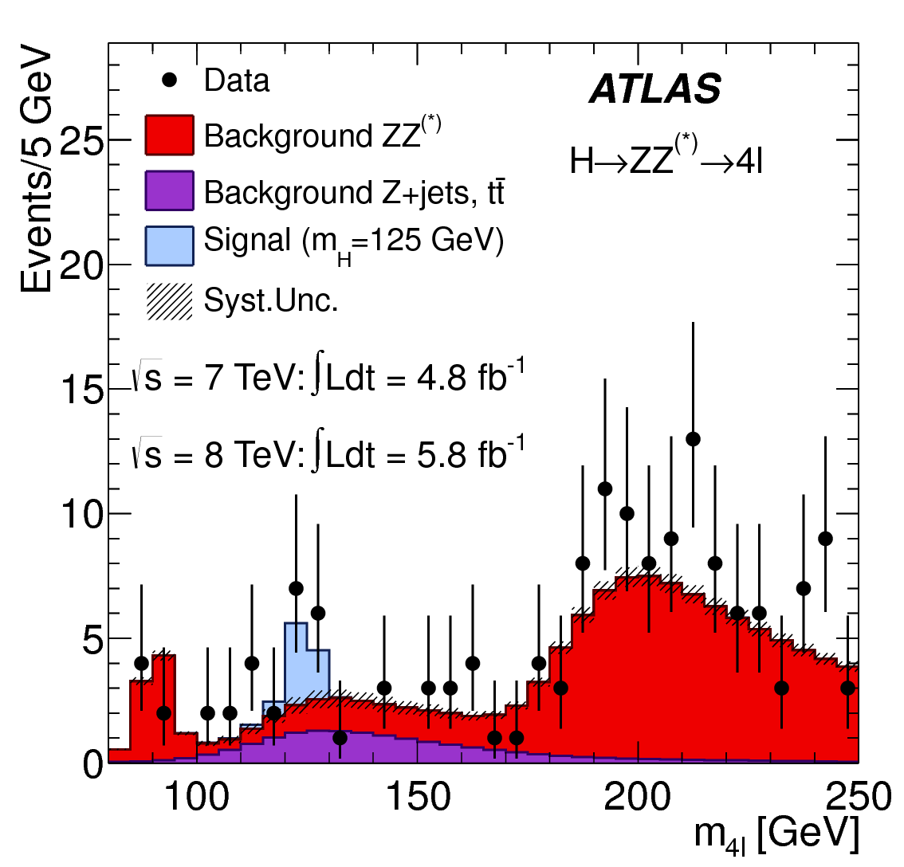
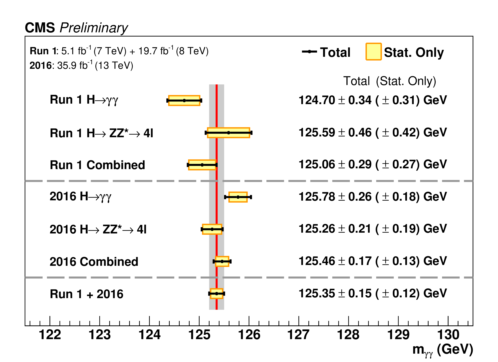
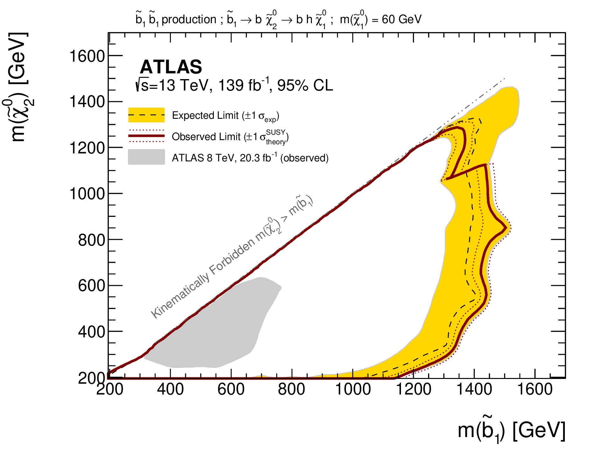

class: middle, center, title-slide
count: false

# pyhf: a pure Python statistical fitting
# library with tensors and autograd

 

.huge.blue[Matthew Feickert] 
.huge[(University of Illinois at Urbana-Champaign)]
.center.width-5[] 
 
[matthew.feickert@cern.ch](mailto:matthew.feickert@cern.ch)

[Talk Event Name](https://talk-event-url)

July DDth, 2020

---
# Self notes while writing talk

- Ensure that your talk will be relevant to a broad range of people. If your talk is on a particular Python package or piece of software, it should useful to more than a niche group.
- Include links to source code, articles, blog posts, or other writing that adds context to the presentation.
- If you've given a talk, tutorial, or other presentation before, include that information as well as a link to slides or a video if they're available.
- .bold[SciPy talks are generally 25 minutes] with 2-3 minutes for questions. Please keep the length of time in mind as you structure your outline.
- Your talk should not be a commercial for your company’s product. However, you are welcome to talk about how your company solved a problem, or notable open-source projects that may benefit attendees.

---
# `pyhf` core dev team

 

.grid[
.kol-1-3.center[
.circle.width-80[]

[Lukas Heinrich](https://github.com/lukasheinrich)

CERN
]
.kol-1-3.center[
.circle.width-80[]

[Matthew Feickert](https://www.matthewfeickert.com/)

Illinois
.center.bold.blue[IRIS-HEP]
]
.kol-1-3.center[
.circle.width-75[]

[Giordon Stark](https://github.com/kratsg)

UCSC SCIPP
]
]

---
# Goals of physics analysis at the LHC

.kol-1-1[
.kol-1-3.center[
.width-100[]
Search for new physics
]
.kol-1-3.center[
 
.width-100[]

 
Make precision measurements
]
.kol-1-3.center[
.width-110[]

Provide constraints on models through setting best limits
]
]

- All require .bold[building statistical models] and .bold[fitting models] to data to perform statistical inference
- Model complexity can be huge for complicated searches
- **Problem:** Time to fit can be .bold[many hours]
- .blue[Goal:] Empower analysts with fast fits and expressive models

---

class: middle

# A transition slide topic

---
# HistFactory Template

 

$$\begin{aligned}
&\mathcal{P}\left(n\_{c}, x\_{e}, a\_{p} \middle|\phi\_{p}, \alpha\_{p}, \gamma\_{b} \right) = \\\\
&{\color{blue}{\prod\_{c \\,\in\\, \textrm{channels}} \left[\textrm{Pois}\left(n\_{c} \middle| \nu\_{c}\right) \prod\_{e=1}^{n\_{c}} f\_{c}\left(x\_{e} \middle| \vec{\alpha}\right)\right]}} {\color{red}{G\left(L\_{0} \middle| \lambda, \Delta\_{L}\right) \prod\_{p\\, \in\\, \mathbb{S}+\Gamma} f\_{p}\left(a\_{p} \middle| \alpha\_{p}\right)}}
\end{aligned}$$

.bold[Use:] Multiple disjoint _channels_ (or regions) of binned distributions with multiple _samples_ contributing to each with additional (possibly shared) systematics between sample estimates

.bold[Main pieces:]

- .blue[Main Poisson p.d.f. for bins observed in all channels]
- .red[Constraint p.d.f. (+ data) for "auxiliary measurements"]
   - encoding systematic uncertainties (normalization, shape, etc)

---
# Formation definition

Following Hopcroft and Ullman (1979, p. 148), a (one-tape) Turing machine can be formally defined as a 7-tuple $M=(Q,\Gamma,b,\Sigma,\delta, q\_0, F)$, where
- $Q$ is a finite, non-empty set of states;
- $\Gamma$ is a finite, non-empty set of tapes alphabet symbols;
- $b \in \Gamma \setminus \\{b\\}$ is the set of input symbols, that is, the set of symbols allowed to appear in the initial tape contents;
- $q\_0 \in Q$ is the initial state;
- $F \subseteq Q$ is the set of final states or accepting states. The initial tape contents is said to be accepted by $M$ if it eventually halts in a state from $F$.
- $\delta: (Q \setminus F) \times \Gamma \rightarrow Q \times \Gamma \times \\{L,R\\}$ is the state transition function.

---

Next slide

.footnote[This is a footnote.]

---

class: middle

# Summary

---

class: middle

- abc
- def
- ghi

---
class: end-slide, center

Backup

---
# References

1. ROOT collaboration, K. Cranmer, G. Lewis, L. Moneta, A. Shibata and W. Verkerke, .italic[[HistFactory: A tool for creating statistical models for use with RooFit and RooStats](http://inspirehep.net/record/1236448)], 2012.
2. L. Heinrich, H. Schulz, J. Turner and Y. Zhou, .italic[[Constraining $A_{4}$ Leptonic Flavour Model Parameters at Colliders and Beyond](https://inspirehep.net/record/1698425)], 2018.

---

class: end-slide, center
count: false

The end.
