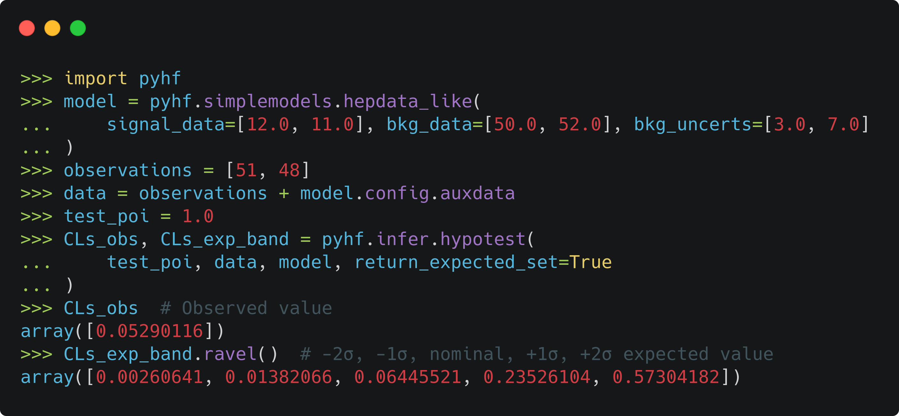
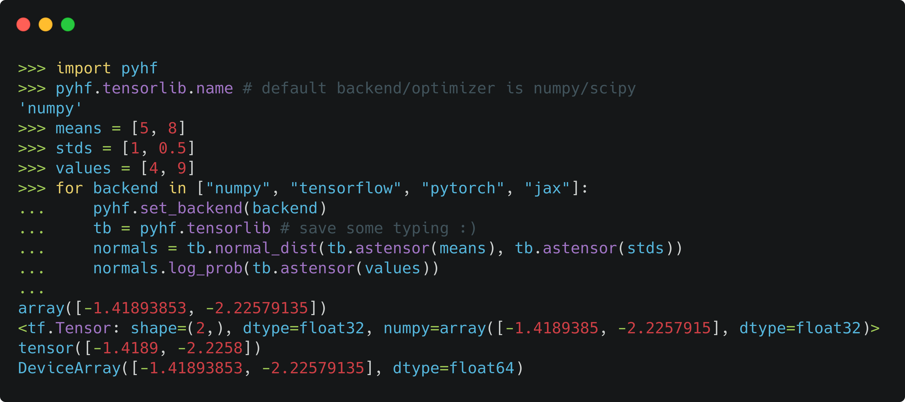

class: middle, center, title-slide
count: false

# pyhf
.large[a pure Python statistical fitting library with tensors and autograd]

.center.width-30[]  
.huge.blue[Matthew Feickert] 

<!-- Provided by fontawesome under the Creative Commons Attribution 4.0 International license https://fontawesome.com/license -->
.width-02[] [matthew.feickert@cern.ch](mailto:matthew.feickert@cern.ch) 
.width-02[] [@HEPfeickert](https://twitter.com/HEPfeickert) 
.width-02[] [matthewfeickert](https://github.com/matthewfeickert)

[SciPy 2020](https://talk-event-url) 
July 7th, 2020

---
# Self notes while writing talk

- Ensure that your talk will be relevant to a broad range of people. If your talk is on a particular Python package or piece of software, it should useful to more than a niche group.
- Include links to source code, articles, blog posts, or other writing that adds context to the presentation.
- If you've given a talk, tutorial, or other presentation before, include that information as well as a link to slides or a video if they're available.
- .bold[SciPy talks are generally 25 minutes] with 2-3 minutes for questions. Please keep the length of time in mind as you structure your outline.
- Your talk should not be a commercial for your company’s product. However, you are welcome to talk about how your company solved a problem, or notable open-source projects that may benefit attendees.
- .bold[NONE OF THESE PEOPLE KNOW WHAT PARTICLE PHYSICS IS]
- Accepted abstract is here: https://github.com/matthewfeickert/SciPy2020-Proposal
   - Use abstract as outline
- [In general track](https://na.eventscloud.com/ehome/487022?&t=d2917a15274e1daf79d80a4253f01e7a)...so think about how this talk will align

---
# `pyhf` core dev team

 

.grid[
.kol-1-3.center[
.circle.width-80[]

[Lukas Heinrich](https://github.com/lukasheinrich)

CERN
]
.kol-1-3.center[
.circle.width-80[]

[Matthew Feickert](https://www.matthewfeickert.com/)

Illinois
]
.kol-1-3.center[
.circle.width-75[]

[Giordon Stark](https://github.com/kratsg)

UCSC SCIPP
]
]

---
# We're high energy particle physicists
.kol-1-2.center[
 
.width-95[]
LHC
]
.kol-1-2.center[
.width-95[]
ATLAS
]
.kol-1-1[
.kol-1-2.center[
.width-45[]
]
.kol-1-2.center[
.kol-1-2.center[
.width-100[]
]
.kol-1-2.center[
.width-85[]
]
]
]

---
# So we want to know

 
.center.width-100[]

---
# Goals of physics analysis at the LHC

.kol-1-1[
.kol-1-3.center[
.width-100[]
Search for new physics
]
.kol-1-3.center[
 
.width-100[]

 
Make precision measurements
]
.kol-1-3.center[
.width-110[]

Provide constraints on models through setting best limits
]
]

- All require .bold[building statistical models] and .bold[fitting models] to data to perform statistical inference
- Model complexity can be huge for complicated searches
- **Problem:** Time to fit can be .bold[many hours]
- .blue[Goal:] Empower analysts with fast fits and expressive models

---
# HistFactory Model

- A flexible probability density function (p.d.f.) template to build binned statistical models
- Developed during work that lead to the Higgs discovery in 2011 [[CERN-OPEN-2012-016](http://inspirehep.net/record/1236448)]
- Widely used by the high energy physics (HEP) community for .bold[measurements of known physics] (Standard Model) and .bold[searches for new physics] (beyond the Standard Model)

.kol-2-8.center[
 
.width-100[]
 
.bold[Standard Model]
]
.kol-3-8.center[
 
.width-100[]
 
 
.bold[Supersymmetry]
]
.kol-3-8.center[
 
.width-100[]
 
.bold[Exotic Physics]
]

---
# HistFactory Template

$$
f\left(\vec{n}, \vec{a}\middle|\vec{\eta}, \vec{\chi}\right) = \color{blue}{\prod\_{c \\,\in\\, \textrm{channels}} \prod\_{b \\,\in\\, \textrm{bins}\_c} \textrm{Pois} \left(n\_{cb} \middle| \nu\_{cb}\left(\vec{\eta}, \vec{\chi}\right)\right)} \\,\color{red}{\prod\_{\chi \\,\in\\, \vec{\chi}} c\_{\chi} \left(a\_{\chi}\middle|\chi\right)}
$$

$$
\nu\_{cb}(\vec{\eta}, \vec{\chi}) = \sum\_{s \\,\in\\, \textrm{samples}} \underbrace{\left(\sum\_{\kappa \\,\in\\, \vec{\kappa}} \kappa\_{scb}(\vec{\eta}, \vec{\chi})\right)}\_{\textrm{multiplicative}} \Bigg(\nu\_{scb}^{0}(\vec{\eta}, \vec{\chi}) + \underbrace{\sum\_{\Delta \\,\in\\, \vec{\Delta}} \Delta\_{scb}(\vec{\eta}, \vec{\chi})}\_{\textrm{additive}}\Bigg)
$$

.bold[Use:] Multiple disjoint _channels_ (or regions) of binned distributions with multiple _samples_ contributing to each with additional (possibly shared) systematics between sample estimates

.bold[Main pieces:]
- .blue[Main Poisson p.d.f. for simultaneous measurement of multiple channels]
- .katex[Event rates] $\nu\_{cb}$ from nominal rate $\nu\_{scb}^{0}$ and rate modifiers $\kappa$ and $\Delta$
- .red[Constraint p.d.f. (+ data) for "auxiliary measurements"]
   - encoding systematic uncertainties (normalization, shape, etc)
- $\vec{n}$: events, $\vec{a}$: auxiliary data, $\vec{\eta}$: unconstrained pars, $\vec{\chi}$: constrained pars

---
# HistFactory Template

$$
f\left(\vec{n}, \vec{a}\middle|\vec{\eta}, \vec{\chi}\right) = \color{blue}{\prod\_{c \\,\in\\, \textrm{channels}} \prod\_{b \\,\in\\, \textrm{bins}\_c} \textrm{Pois} \left(n\_{cb} \middle| \nu\_{cb}\left(\vec{\eta}, \vec{\chi}\right)\right)} \\,\color{red}{\prod\_{\chi \\,\in\\, \vec{\chi}} c\_{\chi} \left(a\_{\chi}\middle|\chi\right)}
$$

Basic structure: simultaneous fit to

- .blue[multiple "channels"] (analysis regions, (stacks of) histograms)
- each region can have .blue[multiple bins]
- coupled to a set of .red[constraint terms]

.center[.bold[This is a _mathematical_ representation!] Nowhere is any software spec defined]
.center[.bold[Until now] (2018), the only implementation of HistFactory has been in a monolithic `C++` library used in HEP (`ROOT`)]

.bold[`pyhf`: HistFactory in pure Python]
.center.width-70[]

---
# Basic object of HistFactory is the statistical model

$$
f\left(\vec{n}, \vec{a}\middle|\vec{\eta}, \vec{\chi}\right) = \prod\_{c \\,\in\\, \textrm{channels}} \prod\_{b \\,\in\\, \textrm{bins}\_c} \textrm{Pois} \left(n\_{cb} \middle| \nu\_{cb}\left(\vec{\eta}, \vec{\chi}\right)\right) \prod\_{\chi \\,\in\\, \vec{\chi}} c\_{\chi} \left(a\_{\chi}\middle|\chi\right)
$$

.center[care about log likelihood as using maximum likelihood fits]

$$
\ln L \left(\vec{\theta} \\,\middle| \vec{x}\right) \Rightarrow \texttt{model.logpdf(parameters, data)}
$$

.center.width-100[]

---
# Model is represented as a computational graph
.grid[
.kol-1-3[
 
- Each node of the graph represents a vectorized n-dimensional array ("tensorized") operation
- The graph (model) is largely factorized between the .pars_blue[parameter] graph and the .data_green[data] graph
- The bottom node is the final log likelihood .value_orange[value]
 
 
$$
\texttt{\textcolor{#ddc16c}{value} = model.logpdf(\textcolor{#73bbe6}{parameters}, \textcolor{#a5dc92}{data})}
$$
]
.kol-2-3[
.center.width-90[]
]
]

---
# Core task: Maximum likelihood fits

$$
\texttt{pyhf.infer.mle.fit(data, model)}
$$

.center[minimizes the objective function $-2\ln L \left(\vec{\theta} \\,\middle| \vec{x}\right)$ (maximizing the likelihood) with the backend's optimizer]
 

.center.width-100[]

---
# Use in profile likelihood fits (thing we care about)
$$
-2\ln \Lambda (\mu) = - 2\ln\frac{L(\mu, \hat{\\!\hat{\theta}})}{L(\hat{\mu}, \hat{\theta})} \quad \frac{\Leftarrow\textrm{constrained best fit}}{\Leftarrow\textrm{unconstrained best fit}}
$$
<!--  -->
to compute a modified $p$-value called the $\mathrm{CL}_{s}$ for a given parameter of interest $\mu$ &mdash; hypothesis testing!
$$
\texttt{pyhf.infer.hypotest(testpoi, data, model)}
$$
<!--  -->
.center[Want this .bold[fast as possible!]]
<!--  -->
.center.width-70[]

---
# JSON spec fully describes the HistFactory model

.kol-1-4.width-100[
- Human & machine readable
- Industry standard
   - Will be with us forever
- Parsable by every language
   - Highly portable
   - No lock in
- Versionable and easily preserved
   - JSON Schema [describing  HistFactory specification](https://scikit-hep.org/pyhf/likelihood.html#bibliography)
   - Attractive for analysis preservation
   - Highly compressible
]
.kol-3-4.center[
.width-105[]

.center[[`JSON` defining a single channel, two bin counting experiment with systematics](https://scikit-hep.org/pyhf/likelihood.html#toy-example)]
]

---
# JSON Patch for signal model (reinterpretation)
<!--  -->
.center[JSON Patch gives ability to .bold[swap signal models]!]
.center[Allows for .bold[separating] the background model from the signal model]
.center[(think scans in parameter space)]
<!--  -->
.kol-1-5[
 
 
 
 
.center.width-100[]
.center[Signal model A]
]
.kol-3-5[
<!-- Using Perl style in Carbon -->
.center.width-100[]
]
.kol-1-5[
 
 
 
 
.center.width-100[]
.center[Signal model B]
]

---
# Allows for analysis preservation and reuse

- Background-only model JSON stored
- Hundreds of signal model JSON Patches stored together as a "patch set" file
- Together are able to fully preserve the full model (with own DOI! .width-20[] )

[.center.width-70[]](https://www.hepdata.net/record/ins1748602)

---
# Likelihood serialization and reproduction
<!--  -->
- ATLAS note on the JSON schema for serialization and reproduction of results [[ATL-PHYS-PUB-2019-029](https://cds.cern.ch/record/2684863)]
   - Contours: .root[█] original ROOT+XML, .pyhf[█] pyhf JSON, .roundtrip[█] JSON converted back to ROOT+XML
      - Overlay of expected limit **contours** (hatching) and observed **lines** nice visualization of near perfect agreement
   - Serialized likelihood and reproduced results of ATLAS Run-2 search for bottom-squarks [[JHEP12(2019)060](http://inspirehep.net/record/1748602)] and published to HEPData
   - Shown to reproduce results but faster! .bold[C++ (ROOT):] 10+ hours .bold[pyhf:] < 30 minutes

.kol-1-2.center.width-95[

]
.kol-1-2.right.width-70[

]

---
# Further speed up by parallelizing across cluster

.kol-1-3[
 
- Running across 25 worker nodes on the cloud
- Background and signal patches are sent to workers on demand
   - Possible as the signal patches don't need information from each other
   - Embarrassingly parallelizable
- Results being plotted as they are streamed back
- Fit of same likelihood now takes .bold[3 minutes] for all signal points!
]
.kol-2-3[
<!-- https://github.com/lukasheinrich/lhoodbinder2 -->
<!-- .center.width-45[] -->
.center.width-70[]
.center.small[(GIF sped up by 8x)]
]

---
# Machine Learning Frameworks for Computation

.grid[
.kol-2-3[
- All numerical operations implemented in .bold[tensor backends] through an API of $n$-dimensional array operations
- Using deep learning frameworks as computational backends allows for .bold[exploitation of auto differentiation (autograd) and GPU acceleration]
- As huge buy in from industry we benefit for free as these frameworks are .bold[continually improved] by professional software engineers (physicists are not)

.kol-1-2.center[
.width-90[]
]
.kol-1-2[
 
- Show hardware acceleration giving .bold[order of magnitude speedup] for some models!
- Improvements over traditional
   - 10 hrs to 30 min; 20 min to 10 sec
]
]
.kol-1-4.center[
.width-85[]
.width-85[]
.width-85[]

 
.width-50[]
]
]

---
# Unified API through `tensorlib` shim
<!--  -->
.kol-1-1[
.kol-1-2.center[
.width-90[]

NumPy
]
.kol-1-2.center[
.width-90[]
 JAX
]
]
.kol-1-1[
.kol-1-2.center[
.width-95[]
 Tensorflow
]
.kol-1-2.center[
.width-95[]
 PyTorch
]
]

---
# Allows for transparently changing backend

.center.width-100[]

---
# Automatic differentiation

With tensor library backends gain access to _exact (higher order) derivatives_ &mdash; accuracy is only limited by floating point precision

$$
\frac{\partial L}{\partial \mu}, \frac{\partial L}{\partial \theta_{i}}
$$

.grid[
.kol-1-2[
.large[Exploit .bold[full gradient of the likelihood] with .bold[modern optimizers] to help speedup fit!]

  
.large[Gain this through the frameworks creating _computational directed acyclic graphs_ and then applying the chain rule (to the operations)]
]
.kol-1-2[
.center.width-80[]
]
]

---
# Publications using `pyhf`

.kol-1-2.center.width-95[
.center.width-70[]

.center.width-40[]
]
.kol-1-2.center.width-95[
.center.width-100[]

.center.width-100[]
]

---
# Summary
.kol-2-3[
.large[`pyhf` provides:]
- .large[.bold[Accelerated] fitting library]
   - reducing time to insight/inference!
   - Hardware acceleration on GPUs and vectorized operations
   - Backend agnostic Python API and CLI
- .large[Flexible .bold[declarative] schema]
   - JSON: ubiquitous, universal support, versionable
- .large[Enabling technology for .bold[reinterpretation]]
   - JSON Patch files for efficient computation of new signal models
   - Unifying tool for theoretical and experimental physicists
- .large[Project in growing .bold[Pythonic HEP ecosystem]]
   - c.f. Jim Pivarski and Henry Schreiner's talks in High Performance Python track
   - Ask us about Scikit-HEP and PyHEP!
]
.kol-1-3[
 
 
 
.center.width-100[]
]

---
class: middle

.center[
# Thanks for listening!
# Come talk with us!

.large[[www.scikit-hep.org/pyhf](https://scikit-hep.org/pyhf/)]
]
.grid[
.kol-1-3.center[
.width-90[]
]
.kol-1-3.center[
 
.width-90[]
]
.kol-1-3.center[
 
 
.width-100[]
]
]

---
class: end-slide, center

Backup

---
# Why is the likelihood important?

 

.kol-1-2.width-90[
- High information-density summary of analysis
- Almost everything we do in the analysis ultimately affects the likelihood and is encapsulated in it
   - Trigger
   - Detector
   - Systematic Uncertainties
   - Event Selection
- Unique representation of the analysis to preserve
]
.kol-1-2.width-90[
   

]

---
# Likelihood serialization and reproduction
<!--  -->
- ATLAS note on the JSON schema for serialization and reproduction of results [[ATL-PHYS-PUB-2019-029](https://cds.cern.ch/record/2684863)]
   - Contours: .root[█] original ROOT+XML, .pyhf[█] pyhf JSON, .roundtrip[█] JSON converted back to ROOT+XML
<!--  -->
.right.width-80[

]

---
# References

1. F. James, Y. Perrin, L. Lyons, .italic[[Workshop on confidence limits: Proceedings](http://inspirehep.net/record/534129)], 2000.
2. ROOT collaboration, K. Cranmer, G. Lewis, L. Moneta, A. Shibata and W. Verkerke, .italic[[HistFactory: A tool for creating statistical models for use with RooFit and RooStats](http://inspirehep.net/record/1236448)], 2012.
3. L. Heinrich, H. Schulz, J. Turner and Y. Zhou, .italic[[Constraining $A_{4}$ Leptonic Flavour Model Parameters at Colliders and Beyond](https://inspirehep.net/record/1698425)], 2018.
4. A. Read, .italic[[Modified frequentist analysis of search results (the $\\mathrm{CL}_{s}$ method)](http://cds.cern.ch/record/451614)], 2000.
5. K. Cranmer, .italic[[CERN Latin-American School of High-Energy Physics: Statistics for Particle Physicists](https://indico.cern.ch/event/208901/contributions/1501047/)], 2013.
6. ATLAS collaboration, .italic[[Search for bottom-squark pair production with the ATLAS detector in final states containing Higgs bosons, b-jets and missing transverse momentum](http://inspirehep.net/record/1748602)], 2019
7. ATLAS collaboration, .italic[[Reproducing searches for new physics with the ATLAS experiment through publication of full statistical likelihoods](https://cds.cern.ch/record/2684863)], 2019
8. ATLAS collaboration, .italic[[Search for bottom-squark pair production with the ATLAS detector in final states containing Higgs bosons, b-jets and missing transverse momentum: HEPData entry](https://www.hepdata.net/record/ins1748602)], 2019

---

class: end-slide, center
count: false

The end.
